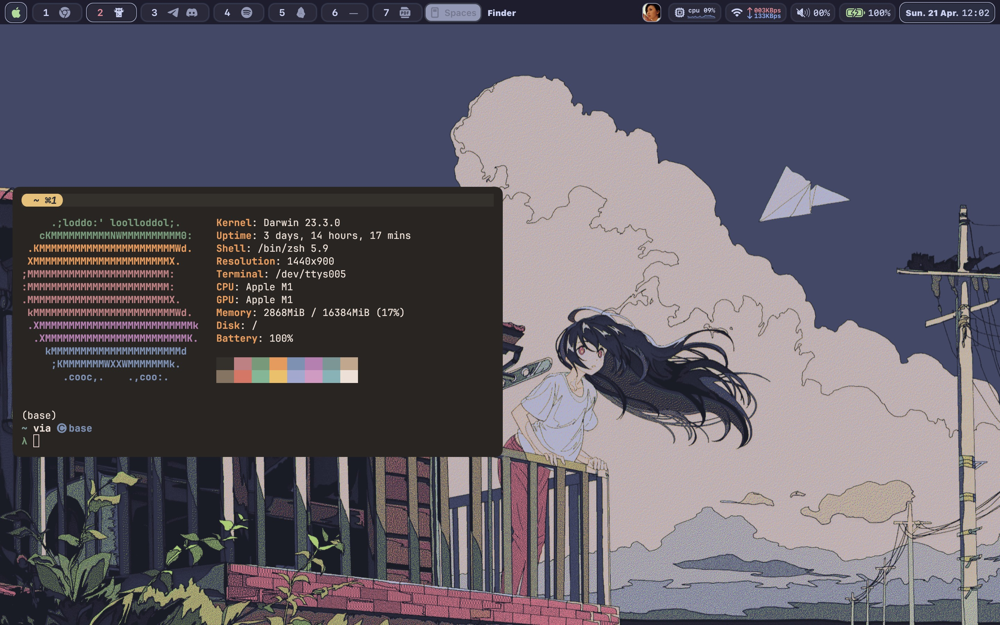

# Dotfiles

My personal workflow.

- Os: _Macos_
- Editor: [NeoVIM](https://github.com/neovim/neovim/)
- Git UI: [Lazygit](https://github.com/jesseduffield/lazygit)
- Git Issue and PR: [gh-dash](https://github.com/dlvhdr/gh-dash)
- Session:[Tmux](https://github.com/gpakosz/.tmux)
- Terminal emulator:[Kitty](https://github.com/kovidgoyal/kitty)
- Window Manager:[Yabai](https://github.com/koekeishiya/yabai)
- Hotkey daemon: [Skhd](https://github.com/koekeishiya/skhd)
- Menu bar: [Sketchybar](https://github.com/FelixKratz/SketchyBar)
- Terminal File manager:[Yazi](https://github.com/sxyazi/yazi)
- Shell: [Zsh](https://www.zsh.org/)
- Theme: [Catppuccin](https://github.com/catppuccin/catppuccin)
- Player: [Mpv](https://github.com/mpv-player/mpv)

## Disclaimer

This is a personal project, I'm not responsible for any damage caused to your system. Use at your own risk.
And You need to install some dependencies to make it work properly.
such as :

- fzf
- ripgrep
- bat
- fd
- exa
- starship
- ...

Maybe I will add a script to install all of them in the future.

## License

MIT
